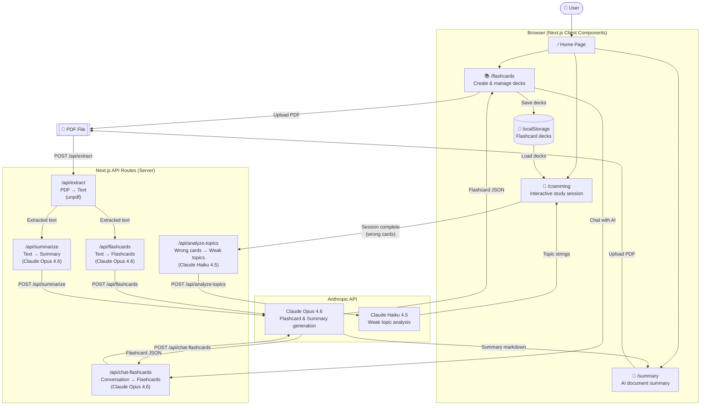

# Clarify

An AI-powered study assistant that transforms PDFs into personalized learning experiences. Upload a document, pick your mood, and Clarify generates flashcards, cramming sessions, or summaries — all powered by Claude.

---

## Architecture



---

## Features

### Flashcard Decks
- Upload any PDF and generate flashcards instantly
- Choose a **mood** to control depth and quantity:

  | Mood | Cards | Style |
  | ---- | ----- | ----- |
  | 😴 Tired | 5 | Short & simple |
  | 😰 Stressed | 3 | Critical points only |
  | 😤 Annoyed | 5 | Blunt, no fluff |
  | 🤓 Curious | 10 | Deep & detailed |

- Name decks, expand to preview cards inline, edit individual Q&A pairs
- Add and delete cards manually
- All decks persisted in `localStorage`

### Chat-Based Flashcard Generation
- Generate flashcards on any topic through natural conversation — no PDF required
- Toggle "Chat with AI" on the flashcards page to open the chat panel
- Describe a topic and Claude generates 8 flashcards by default; ask for more, fewer, or a different focus and it regenerates the full set
- Claude may ask one clarifying question (depth, level, specific focus) before generating

### Cramming Sessions
- Pick any saved deck and start studying immediately
- Flip cards by clicking or keyboard shortcuts
- Mark each card **Know It** or **Don't Know**
- Real-time progress bar showing known / unknown / unreviewed counts
- Session statistics on completion:
  - Accuracy percentage and performance grade
  - Time spent total and per card
  - AI-identified weak topics from missed cards
  - Full list of cards you got wrong
- Retry only the wrong cards, or reset and go again
- Rename the deck inline during a session
- End session early with "Finish Session" button

### Keyboard Controls

| Key                   | Action                         |
| --------------------- | ------------------------------ |
| W / S / Space / ↑ / ↓ | Flip card                      |
| A / D / ← / →         | Navigate to previous/next card |

### AI Summaries
- Upload a PDF and receive a mood-tailored summary:

  | Mood | Style |
  | ---- | ----- |
  | 😴 Tired | 5 bullets, ≤ 10 words each + funny analogy |
  | 😰 Stressed | 3 numbered critical points, calm tone |
  | 😤 Annoyed | Blunt, no intro, fewest words possible |
  | 🤓 Curious | Deep dive with insights and real-world context |

- Two-stage loading: shows "Extracting PDF..." then "Generating summary..."
- Rendered markdown with styled headings, bullets, and inline bold
- Copy to clipboard or download as a formatted PDF

---

## Mood System

The app's core innovation is the **mood system** — four distinct emotional states that shape how the AI generates content. Each mood controls both the quantity and style of output.

### Mood Selection

Choose your current mental state when generating content:

| Mood | When to Use |
| ---- | ----------- |
| 😴 **Tired** | Late night studying, quick reviews |
| 😰 **Stressed** | Exam eve, need only the essentials |
| 😤 **Annoyed** | Want to get it done fast, no fluff |
| 🤓 **Curious** | Deep learning, thorough understanding |

### Flashcard Output

| Mood | Card Count | Characteristics |
| ---- | ---------- | ---------------- |
| 😴 Tired | 5 | Super short Q&A, minimal detail |
| 😰 Stressed | 3 | Only critical points, cram-friendly |
| 😤 Annoyed | 5 | Blunt, direct, no filler |
| 🤓 Curious | 10 | Comprehensive, includes nuances |

### Summary Output

| Mood | Output Style |
| ---- | ------------ |
| 😴 Tired | 5 bullets max, ≤10 words each, includes a funny analogy |
| 😰 Stressed | 3 numbered critical points, calming tone |
| 😤 Annoyed | Fewest words possible, no intro/outro |
| 🤓 Curious | Full markdown with headings, insights, context |

---

## Tech Stack

| Layer | Technology |
| ----- | ---------- |
| Framework | [Next.js 16.2.3](https://nextjs.org/) (App Router) |
| Language | [TypeScript 6](https://www.typescriptlang.org/) (strict mode) |
| Styling | [Tailwind CSS v4](https://tailwindcss.com/) |
| UI Components | [shadcn/ui](https://ui.shadcn.com/) + [Base UI](https://baseui.com/) + [Lucide React](https://lucide.dev/) |
| AI | [Anthropic Claude](https://anthropic.com) (Opus 4.6 + Haiku 4.5) |
| PDF Extraction | [unpdf](https://github.com/unjs/unpdf) |
| PDF Export | [jsPDF](https://github.com/parallax/jsPDF) |
| Fonts | Geist Sans + Geist Mono (next/font) |
| Storage | Browser localStorage |
| Deployment | [Vercel](https://vercel.com) |

---

## Project Structure

```bash
clarify/
├── app/
│   ├── api/
│   │   ├── extract/route.js            # PDF → plain text (unpdf)
│   │   ├── flashcards/route.js         # Text → flashcard JSON (Claude Opus)
│   │   ├── chat-flashcards/route.js   # Conversation → flashcards (Claude Opus)
│   │   ├── summarize/route.js        # Text → summary markdown (Claude Opus)
│   │   └── analyze-topics/route.js    # Wrong cards → weak topics (Claude Haiku)
│   ├── cramming/
│   │   └── page.tsx                   # Interactive study session
│   ├── flashcards/
│   │   └── page.tsx                   # Deck management + creation + AI chat
│   ├── summary/
│   │   └── page.tsx                   # PDF summarization
│   ├── utils/
│   │   ├── aiApi.ts                   # Client-side API helpers + types
│   │   ├── crammingHelpers.ts         # Session logic helpers
│   │   └── deckAccents.ts             # Deck color accent classes
│   ├── globals.css
│   ├── layout.tsx
│   └── page.tsx                       # Landing page
├── components/
│   ├── flashcards/                    # Flashcard components
│   │   ├── CreateDeckView.tsx
│   │   ├── EditDeckView.tsx
│   │   ├── DeckCard.tsx
│   │   ├── ChatDeckCreator.tsx
│   │   ├── QACard.tsx
│   │   ├── ModeToggle.tsx
│   │   ├── DeckActions.tsx
│   │   └── ConfirmDeleteModal.tsx
│   ├── summary/                       # Summary components
│   │   ├── FileUpload.tsx
│   │   ├── SummaryContent.tsx
│   │   ├── RenderSummary.tsx
│   │   ├── ProcessingPDF.tsx
│   │   ├── MoodSelector.tsx
│   │   └── ActionsSection.tsx
│   └── ui/                            # shadcn/ui base components
│       ├── button.tsx
│       └── navigation-menu.tsx
├── lib/
│   ├── utils.ts                       # cn() className merger
│   └── prompts.js                     # Mood-based prompt templates
├── utils/
│   ├── flashcardStorage.ts            # localStorage helpers
│   └── pdfExport.ts                   # PDF download functionality
├── package.json
├── next.config.ts
└── tsconfig.json
```

---

## Getting Started

### Prerequisites
- Node.js 18+
- An [Anthropic API key](https://console.anthropic.com/)

### Installation

```bash
git clone https://github.com/SamuelIVX/clarify.git
cd clarify
npm install
```

### Environment Variables

Create a `.env.local` file in the project root:

```env
# .env.local
ANTHROPIC_API_KEY=your_anthropic_api_key_here
```

### Run Locally

```bash
npm run dev
```

Open [http://localhost:3000](http://localhost:3000).

### Build for Production

```bash
npm run build
npm start
```

---

## Deployment

The app is deployed on [Vercel](https://vercel.com). To deploy your own:

1. Push to `main` — Vercel auto-deploys on every push when connected to GitHub.
2. Add `ANTHROPIC_API_KEY` in your Vercel project under **Settings → Environment Variables**.

> The `/api/extract` route sets `maxDuration = 60` to handle large PDFs within Vercel's serverless timeout.

---

## API Routes

| Route | Method | Input | Output | Model |
| ----- | ------ | ----- | ------ | ----- |
| `/api/extract` | POST | `FormData { pdf: File }` | `{ text: string }` | — (unpdf) |
| `/api/flashcards` | POST | `{ text, mood }` | `{ flashcards: [{question, answer}] }` | Claude Opus 4.6 |
| `/api/chat-flashcards` | POST | `{ messages: Message[] }` | `{ message: string, flashcards: [{question, answer}] \| null }` | Claude Opus 4.6 |
| `/api/summarize` | POST | `{ text, mood }` | `{ summary: string }` | Claude Opus 4.6 |
| `/api/analyze-topics` | POST | `{ flashcards: Flashcard[] }` | `{ topics: string[] }` | Claude Haiku 4.5 |

All routes run server-side only. `ANTHROPIC_API_KEY` is never exposed to the client.
